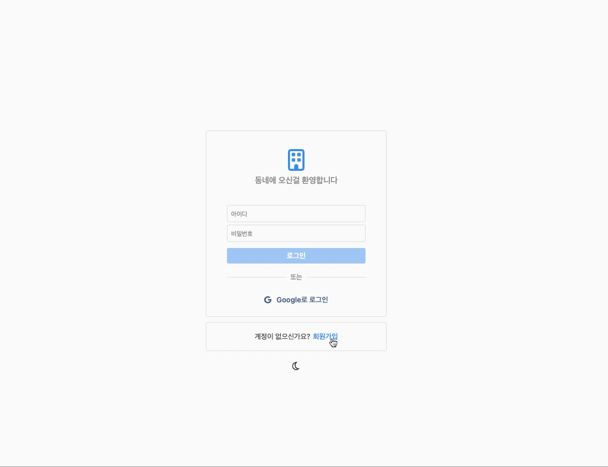

  <a href="">
    
      
    
      
    
  </a>

## Table of contents

- 🔥 [Stack](#stack)
- 🌈 [Project](#project)
- 📑 [Pages](#pages)
- ⚙ [Features](#features)

## Stack

### Front-end

- `Typescript`
- `React`
- `Apollo Client`
- `GraphQL Code Generator`
- `Framer Motion`
- `Styled Components`

### Back-end

- `NodeJS`
- `Express`
- `PostgreSQL`
- `Apollo Server`
- `GraphQL`
- `Prisma`
- `JsonWebToken`

### App

- `React Native`
- `Expo`
- `Typescript`
- `Apollo Client`
- `React Navigation`
- `Styled Components`
- `GraphQL Code Generator`

### Deploy

- `Netlify`
- `Heroku`
- `AWS S3`

## Project

> 1. 회원가입, 로그인, 로그아웃

- 유저는 아이디, 비밀번호, 사용자 이름, 이메일을 입력해 회원가입을 할 수 있습니다.
- 회원가입 시, 비밀번호는 `Bcrypt`를 사용하여 해시화되며, 회원가입된 유저는 `PostgreSQL`에 저장됩니다.
- 유저는 아이디, 비밀번호를 입력하여 로그인할 수 있습니다.
- 로그인 시, `JsonWebToken`을 받고 해당 Token을 로컬 스토리지에 저장합니다.
- `Apollo Client3`의 새로운 기능인 `Reactive variables`를 사용하여 local state를 업데이트합니다.
- `Reactive variables`를 수정하게되면 해당 변수에 의존하는 모든 활성 쿼리의 업데이트가 자동으로 실행됩니다.
- 로그아웃 시, `Reactive variables`를 수정하고, 로컬 스토리지내에 저장된 Token과 스토어에 저장된 데이터를 제거합니다.
    
  
